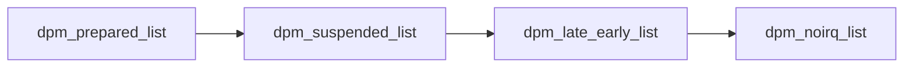
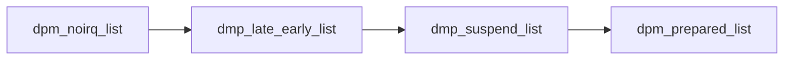

# 基本内嵌结构：kobject与kset
### Runtime PM

&emsp;&emsp;dpm suspend的顺序：

```mermaid
graph LR

dpm_prepared_list-->dpm_suspended_list-->dpm_late_early_list-->dpm_noirq_list
```

&emsp;&emsp;dpm resume的顺序：

```mermaid
graph LR

dpm_noirq_list-->dmp_late_early_list-->dmp_suspend_list-->dpm_prepared_list
```

